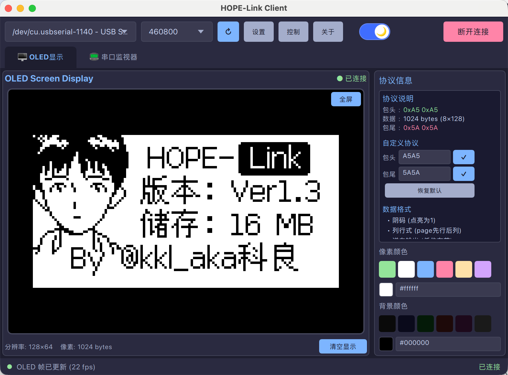
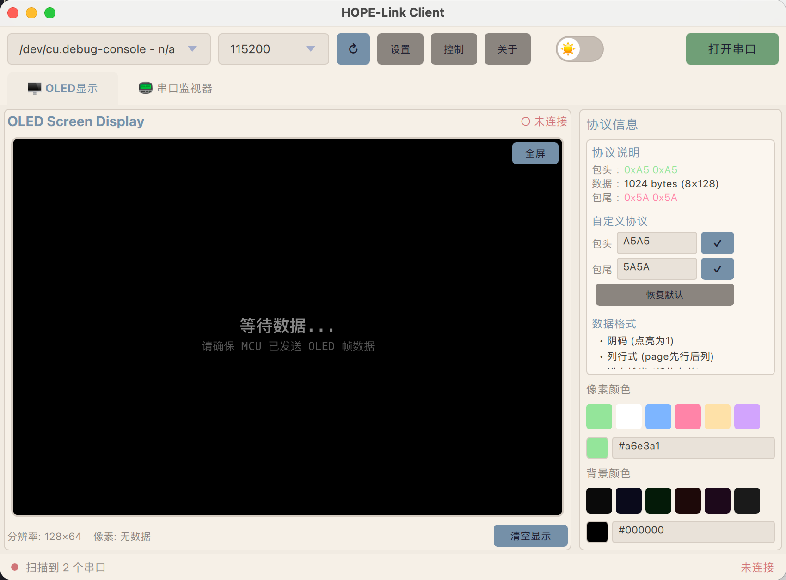
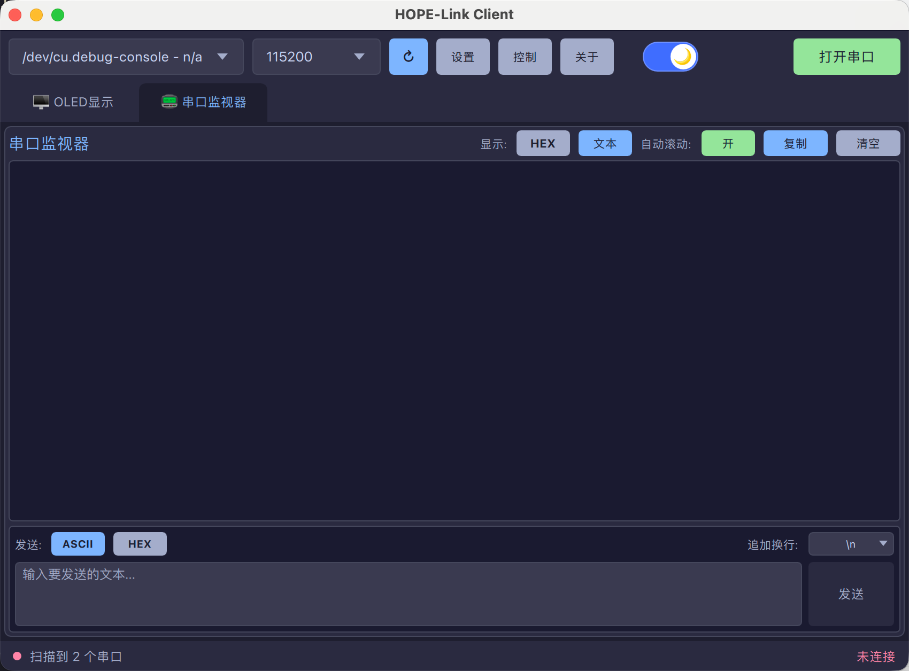

<p align="center">
  
</p>
  <h1 align="center">
  HOPE-Link-Client
</h1>
<p align="center">
  Created by Hugo@kkl
</p>

---

<!-- # HOPE-Link-Client

# by Hugo@kkl -->

> [!TIP]
> Just a simple client for HOPE-Link(A little toy). 
> **该程序支持跨平台：`Windows/MacOS/Ubuntu`.**


## Snapshot




## Showcase
https://github.com/user-attachments/assets/124f6f75-b7b5-4ffa-9624-459147c83b32


## Install

```shell
# 创建python虚拟环境
conda create -n pyside6 python=3.11

# 激活环境
conda activate pyside6

# 安装pyside6组件
pip install pyside6

# 安装依赖
pip install -r requirements.txt

# Ubuntu安装X11相关依赖
sudo apt install libxcb-cursor0 libxcb-xinerama0 libxcb-randr0 libxcb-render0 libxcb-shape0 libxcb-xfixes0 libxcb-xkb-dev libxkbcommon-x11-0

# 编译resources.qrc
python scripts/compile_resources.py

# 运行项目
python main.py
```

- thanks：https://www.cnblogs.com/mthoutai/p/19613677


## Ubuntu的Serial权限问题

> Linux报错没有打开串口权限`/dev/ttyACM0`，`PermissionError: [Errno 13] Permission denied: ‘/dev/ttyACM0’`


```shell
# 查看系统用户
whoami
# hugokkl

# 加用户权限组
sudo usermod -aG dialout hugokkl

# 然后重启系统，即可
```

## Pack

```shell
pip install pyinstaller

pyinstaller --onefile --name="HOPE-Link-Client" --collect-all PySide6 main.py

# 不带窗体调试
pyinstaller --onefile --windowed --name="HOPE-Link-Client" --collect-all PySide6 main.py

# 生成exe后，将其放到project根目录下，即可双击启动！
```

## 关于MacOS串口传输拆包问题

相同的下位机，在实测环境波特率为`921600`，串口转ttl为`CH340`下，Windows/Ubuntu能够正常图传；而MacOS会出现拆包现象，图片帧数据不完整，寻找包头或者包尾失败，导致图片传输失败。

经过实测，设置波特率为`460800`，能够正常图传。

> btw，不知道是WCH驱动对Mac的支持差，还是Mac本身的串口机制就有问题，总之很sad！


## TODO List

- 补全`控制`页面，完善与下位机的总线通信协议：暂定首选`json-rpc`，指令集较少可以考虑使用`开头帧`的方法；
- 补全资源管理的方式，随着文件和页面的增多，需要有一个合理的方式来管理和分类不同的功能文件，参考一下热门项目的文件树结构；
- 补全项目版本，方便后期发布release；
- 需要兼容串口最基本的调试能力，这块后期可以单独再开一个页面，或者直接在main主页面当中增加，需要让用户直观的看到数据的显示，如果再出现之前的MacOS的那种拆包问题的时候，能够更快的debug出链路断联处；

- 借此机会，整合一个新的qml的UI组件美化库，开一个新的仓库专门维护。

- 目前打包release的大小偏大，引入了许多没有用到的库插件，后续需要精细的优化。